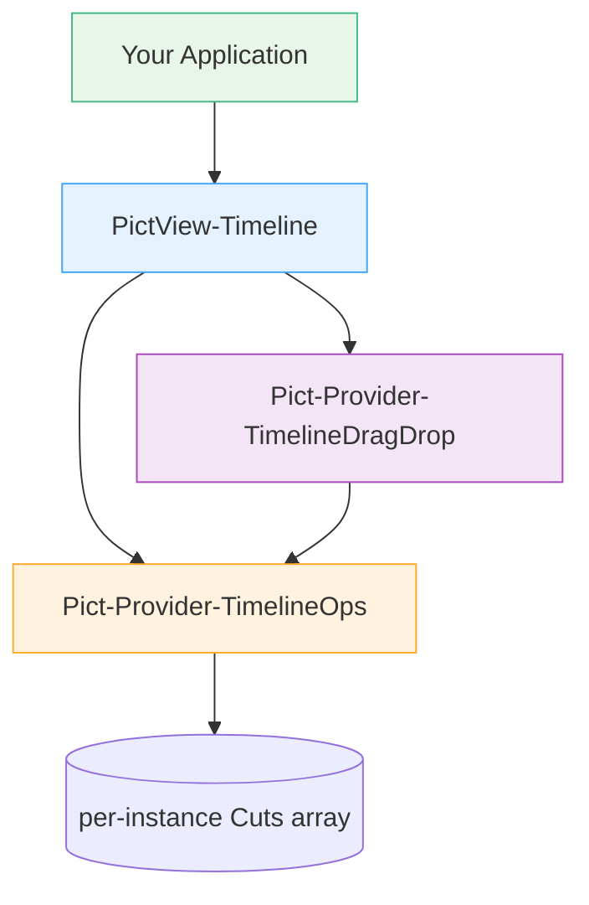
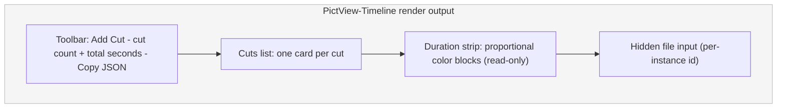
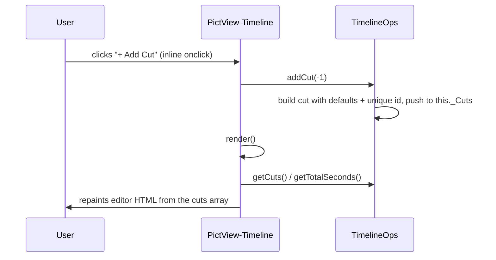
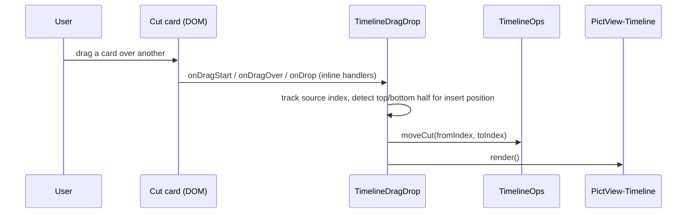

# Architecture

`pict-editor-timeline` is one Pict view backed by two providers. The view renders the editor and owns the public API; one provider owns the data model, the other owns drag-and-drop reordering. All three extend the standard Pict/Fable base classes and register with the Pict instance through the service provider pattern.

## Component Overview



| Component | File | Role |
|-----------|------|------|
| `PictView-Timeline` | `source/views/PictView-Timeline.js` | Container view. Builds the editor HTML, owns the public API, resolves the media adapter, handles image uploads and the duration steppers. Extends `pict-view`. |
| `Pict-Provider-TimelineOps` | `source/providers/Pict-Provider-TimelineOps.js` | Data model. Owns the cuts array; implements all cut mutations and storyboard import/export. No DOM knowledge. Extends `pict-provider`. |
| `Pict-Provider-TimelineDragDrop` | `source/providers/Pict-Provider-TimelineDragDrop.js` | HTML5 drag-and-drop reordering. Tracks drag state, computes insert position, delegates the array move to the ops provider. Extends `pict-provider`. |

The default configuration and CSS live alongside the view in `PictView-Timeline-DefaultConfiguration.js` and `PictView-Timeline-CSS.js`. The package's `main` entry, `source/Pict-Section-Timeline.js`, re-exports the view class as the default export plus the two provider classes for advanced use.

## Module Exports

```javascript
const libPictEditorTimeline = require('pict-editor-timeline');

libPictEditorTimeline                          // the PictView-Timeline class (default export)
libPictEditorTimeline.default_configuration    // the view's default configuration object
libPictEditorTimeline.TimelineOpsProvider      // Pict-Provider-TimelineOps class
libPictEditorTimeline.TimelineDragDropProvider // Pict-Provider-TimelineDragDrop class
```

Registering the default export with `pict.addView()` is all most consumers need - the view creates its own providers internally.

## Provider Wiring

When `PictView-Timeline` is constructed, it creates its two providers via `this.pict.addProvider()`, using the view's service hash (defaulting to `Timeline`) as a prefix:

```javascript
this._TimelineOps = this.pict.addProvider(tmpHash + '-Ops', {}, libTimelineOps);
this._TimelineOps._ParentTimeline = this;

this._DragDrop = this.pict.addProvider(tmpHash + '-DragDrop', {}, libTimelineDragDrop);
this._DragDrop._ParentTimeline = this;
```

Each provider gets a back-reference to its parent view (`_ParentTimeline`). The providers use that reference to read view options and to call `this._ParentTimeline.render()` after a mutation or reorder.

The view also computes a per-instance ID for its hidden file `<input>` (`pet-media-upload-<hash>`) so that multiple timelines on the same page do not share - and clobber - a single global file picker.

## Per-Instance State

State isolation is a deliberate design point. The ops provider keeps its cuts in `this._Cuts`, an array it owns directly - **not** in a shared `pict.AppData` path. Because each `PictView-Timeline` instance creates its own ops provider, every timeline on the page has fully independent cuts.

The test suite pins this down: two ops instances do not share cuts, `loadStoryboard()` on one does not affect another, and repeatedly constructing fresh ops instances (the pattern a polling host might use) never accumulates state across them.

## Rendering

The view overrides `render()` directly and builds the editor as an HTML string assigned to the destination element. (It does not use Pict's `Templates`/`Renderables` machinery - the configuration's `DefaultRenderable` field is vestigial.) A single `render()` call emits four regions:



Each **cut card** is a draggable row containing, left to right:

- a drag handle and a `#N` cut-number badge
- a **start-frame** image slot (thumbnail + remove button when populated, otherwise a click-to-upload drop zone with an optional Browse chip)
- the **prompt** textarea and the **duration** stepper (`-` / value / `+`)
- an **end-frame** image slot (same behavior as the start slot)
- **duplicate** and **delete** action buttons

The cards carry inline `ondragstart` / `ondragover` / `ondragleave` / `ondrop` / `ondragend` handlers that call into the drag-drop provider, and inline `onclick` / `oninput` handlers that call back into the view (e.g. `addCut`, `updateCut`, `duplicateCut`, `removeCut`, the duration adjuster, and the image-upload trigger). The handlers reference the live instances via `window.pict.views[...]` and `window.pict.providers[...]`.

The **duration strip** renders only when there is at least one cut and a positive total. Each block's width is that cut's share of the total duration, and the block color cycles through a palette of `--theme-color-data-*` tokens (with hex fallbacks).

## Data Flow: a Mutation



The convenience methods on the view (`addCut`, `removeCut`, `duplicateCut`, `loadStoryboard`) each delegate to the ops provider and then call `render()`. The one exception is `updateCut()`, which intentionally does not re-render so that typing into the prompt textarea stays smooth; callers decide when to repaint.

## Data Flow: a Reorder



The drag-drop provider keeps a `_DragState` with the source index, target index, and whether the cursor is in the top or bottom half of the hovered card (insert-before vs insert-after). On drop it adjusts the target index for the insert position and for the downward-shift that removing the source row causes, then calls `TimelineOps.moveCut()` and re-renders. CSS classes (`pet-dragging`, `pet-drag-insert-before`, `pet-drag-insert-after`) provide the visual feedback and are cleared on drag end.

## The Media Adapter

The view resolves an effective media adapter once at construction time (`_resolveMediaAdapter()`):

- If `options.MediaAdapter` exposes any of `onMediaProvided` / `getMediaUrl` / `onBrowseMedia`, it is used directly.
- Otherwise, if the legacy `options.ImageAdapter` (`{ onImageProvided, getThumbnailUrl }`) is present, it is wrapped in a thin shim that adapts it to the kind-aware interface for `pKind === 'image'`.
- Otherwise the adapter is `null`, and the editor falls back to reading dropped files as `data:` URLs via `FileReader`.

At render time, populated slots call `_getMediaUrl(kind, ref)` to resolve a thumbnail URL (falling through to the raw reference when no adapter is set), and empty slots show a Browse chip only when `_hasBrowseMedia(kind)` is true - that is, when the adapter has an `onBrowseMedia` hook and the kind is in its `supportedKinds` (or `supportedKinds` is omitted, meaning "all kinds").

## CSS

All styles are defined as a string in `PictView-Timeline-CSS.js` and injected through the Pict CSS cascade via the view's `CSS` option (hash `View-Editor-Timeline`, priority `500`). Every class is prefixed `pet-` (Pict Editor Timeline). The theme is dark by default but recolorable: colors are written as `var(--theme-color-*, <hex fallback>)`, so a host theme provider can restyle the editor without touching source.

## Design Patterns

### View owns the API, providers own the work

Host applications hold a reference to the view (`pict.views.<id>`) and call its methods. The view is a thin orchestrator: it builds HTML and forwards data operations to the ops provider and reorder operations to the drag-drop provider. Keeping the data model in a DOM-free provider makes the mutation logic directly unit-testable, which is exactly how the test suite exercises it.

### Decoupled from any backend

The library has no dependency on any video-generation system. The storyboard export ([Data Model](data-model.md)) is the only contract, and the media adapter is the only seam for host-specific storage. This is why the editor runs standalone with a `data:` URL fallback and slots cleanly into a larger application when one supplies an adapter.

## See Also

- [Data Model](data-model.md) - the cut object and the exported storyboard JSON schema
- [Quick Start](quickstart.md) - registering the view and wiring a media adapter
