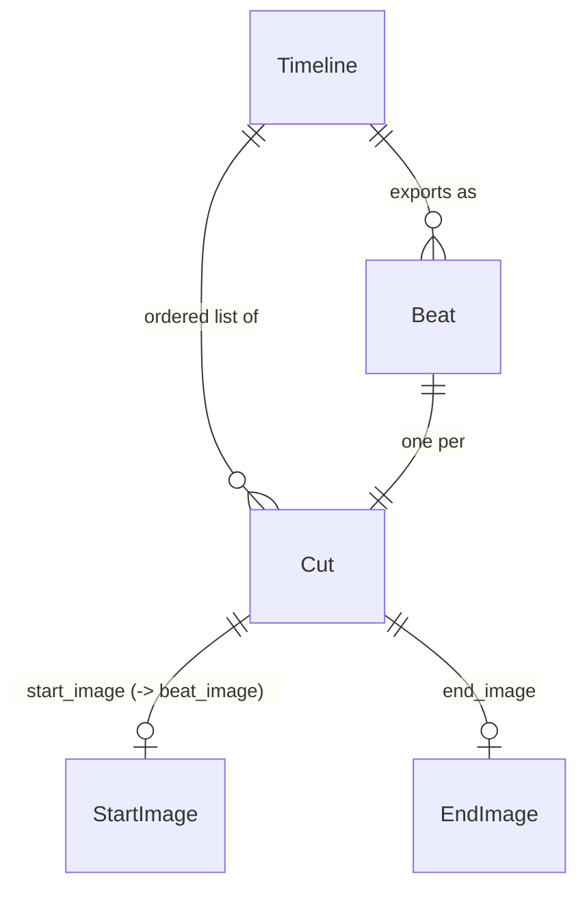

# Data Model

The timeline editor works with two shapes:

1. The **cut** - the internal object the editor edits and renders, one per row.
2. The **storyboard beat** - the clean object the editor exports for downstream consumption.

The export deliberately differs from the internal shape: it drops UI-only fields and renames one image field. This page documents both, verified against the `Pict-Provider-TimelineOps` source.

## The Cut (internal)

Each cut is a plain object owned by the ops provider's per-instance cuts array.

```javascript
{
	// Identity - auto-assigned, stable across reorders.
	id: 'cut-0',

	// Content.
	prompt: 'A woman walks through a garden at golden hour',
	target_seconds: 3,

	// Image references. Opaque strings - a data: URL in standalone mode,
	// or whatever reference string a host's MediaAdapter returns
	// (a path, a GUID, a URL).
	start_image: '',   // first-frame reference
	end_image: '',     // last-frame reference (optional)

	// Transient UI state - never exported.
	_collapsed: false,
	_dragOver: false
}
```

| Field | Type | Notes |
|-------|------|-------|
| `id` | string | `'cut-' + N`, where `N` is a per-instance counter. Unique within an instance and stable across reorders. Not exported. |
| `prompt` | string | The text describing the cut. |
| `target_seconds` | number | The cut's duration. Steppers clamp it to `MinTargetSeconds`..`MaxTargetSeconds` (default 0.5-30) in 0.5s increments. |
| `start_image` | string | Start-frame reference. Empty string when unset. Exported as `beat_image`. |
| `end_image` | string | End-frame reference. Empty string when unset. Optional. |
| `_collapsed` | boolean | UI state. Not exported. |
| `_dragOver` | boolean | UI state. Not exported. |

New cuts are built from `DEFAULT_CUT` (`prompt: ''`, `target_seconds: 2`, `start_image: ''`, `end_image: ''`) merged with the view's `DefaultCut` option, then stamped with a fresh `id` and the transient UI flags.

## The Storyboard Beat (exported)

`getStoryboard()` returns an **array of beat objects** - one per cut, in order. This is the contract between the editor and any downstream video-generation system. The structure is built field by field in `Pict-Provider-TimelineOps.getStoryboard()`:

```javascript
{
	// Always present (defaults to an empty string).
	prompt: 'A woman walks through a garden at golden hour',

	// Present only when target_seconds parses to a number > 0.
	target_seconds: 3,

	// Present only when the cut's start_image is a non-empty string.
	// NOTE the rename: the cut's start_image becomes the beat's beat_image.
	beat_image: '/path/to/garden.jpg',

	// Present only when the cut's end_image is a non-empty string.
	// Advisory - preserved for the user and for future end-frame
	// targeting, but not required by the export contract.
	end_image: '/path/to/flower.jpg'
}
```

### Field-by-field export rules

| Beat field | Source | Included when |
|------------|--------|---------------|
| `prompt` | cut `prompt` | Always. Falls back to `''` if the cut has no prompt. |
| `target_seconds` | cut `target_seconds` (parsed with `parseFloat`) | Only when the parsed value is `> 0`. A non-numeric or non-positive duration is omitted entirely. |
| `beat_image` | cut `start_image` | Only when `start_image` is a non-empty string. |
| `end_image` | cut `end_image` | Only when `end_image` is a non-empty string. |

The export **never** includes `id`, `start_image` (it is renamed to `beat_image`), `_collapsed`, or `_dragOver`. Empty optional fields are omitted rather than emitted as empty strings.

### Example

A two-cut timeline where the first cut has a prompt, a 3s duration, and a start image, and the second has only a prompt and a 2s duration, exports as:

```json
[
	{
		"prompt": "A woman walks through a garden at golden hour",
		"target_seconds": 3,
		"beat_image": "/path/to/garden.jpg"
	},
	{
		"prompt": "She bends down to pick a flower",
		"target_seconds": 2
	}
]
```

### getStoryboardJSON()

`getStoryboardJSON()` returns the same array serialized with `JSON.stringify(..., null, '\t')` - tab-indented JSON. This is what the toolbar's **Copy JSON** button writes to the clipboard.

## Import

`loadStoryboard(pStoryboard)` populates the timeline from a storyboard. It:

- accepts either a parsed **array** or a **JSON string** (a string is `JSON.parse`d; a parse failure is logged and the load aborts);
- requires the top-level value to be an array (otherwise it logs an error and aborts);
- **clears any existing cuts** and resets the cut-ID counter before loading;
- creates one cut per beat.

Per-beat field mapping when loading:

| Cut field | Source in the beat | Fallback |
|-----------|--------------------|----------|
| `prompt` | `prompt` | `''` |
| `target_seconds` | `target_seconds` (parsed) | then `extend_frames / FPS` (FPS default 16, rounded to 1 decimal) if present; otherwise `2` |
| `start_image` | `beat_image`, then `start_image` | `''` |
| `end_image` | `end_image` | `''` |

Two things worth calling out:

- **`beat_image` round-trips.** Because import reads `beat_image` into the cut's `start_image`, and export writes `start_image` back out as `beat_image`, an exported storyboard re-imports cleanly. The import also accepts a raw `start_image` field for convenience (this is what the playground seed data uses).
- **`extend_frames` is a legacy convenience.** A beat that specifies `extend_frames` instead of `target_seconds` is converted to seconds by dividing by `FPS` (default 16). For example, `extend_frames: 48` becomes `target_seconds: 3`.

## Round-Trip Guarantee

Export -> import -> export produces **identical JSON**. The test suite verifies this directly: a timeline is exported to a JSON string, imported into a fresh ops instance, and re-exported; the two strings are asserted equal.

```javascript
let tmpExport1 = _Instance.getStoryboardJSON();
let tmpView2 = /* a second timeline instance */;
tmpView2.loadStoryboard(tmpExport1);
let tmpExport2 = tmpView2.getStoryboardJSON();
// tmpExport1 === tmpExport2
```

## Relationships



## See Also

- [Quick Start](quickstart.md) - `loadStoryboard()` and `getStoryboard()` in context
- [Architecture](architecture.md) - where the cuts array lives and how it stays per-instance
